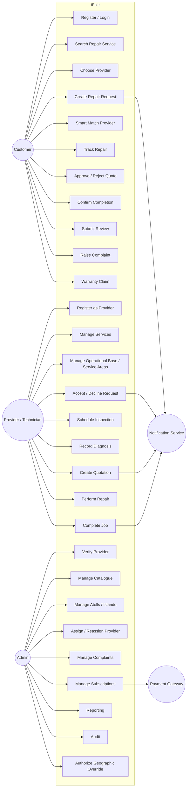
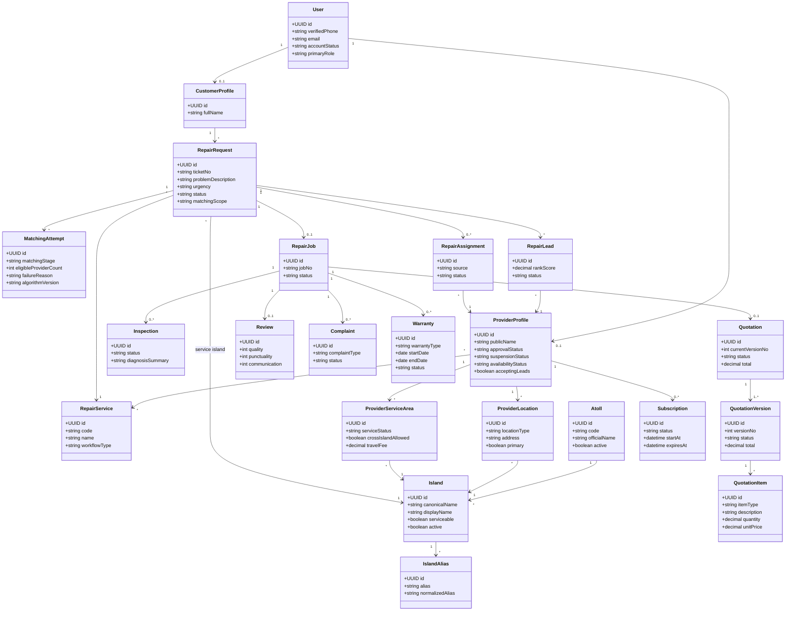
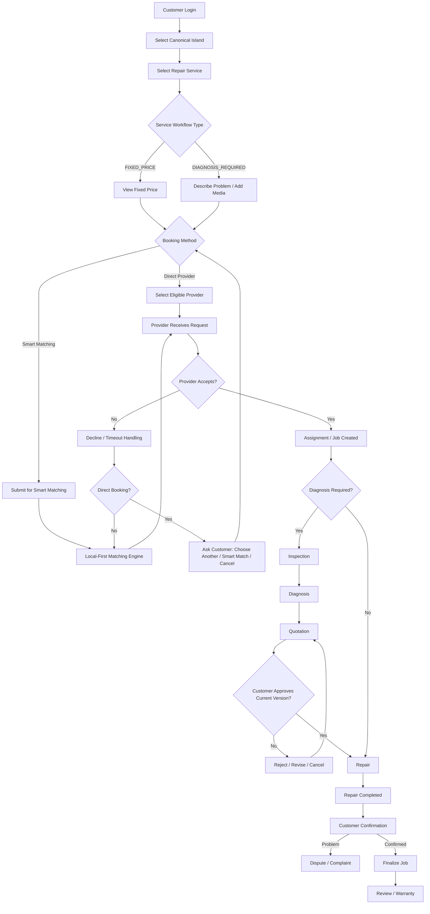
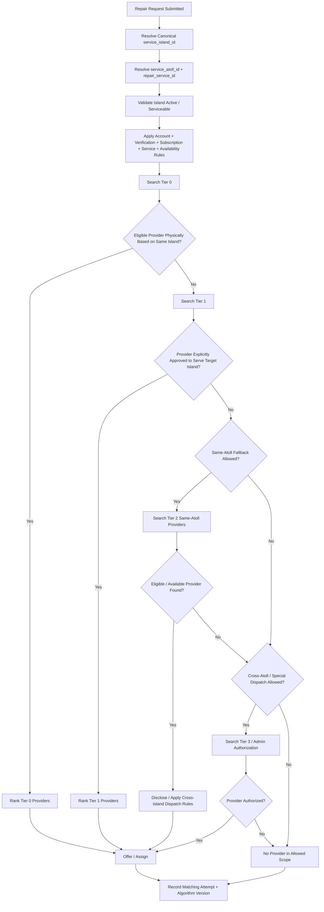
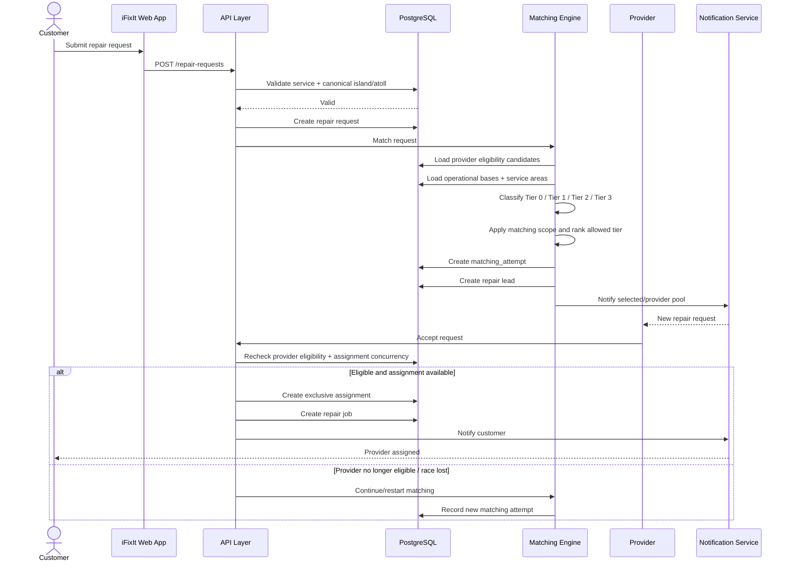
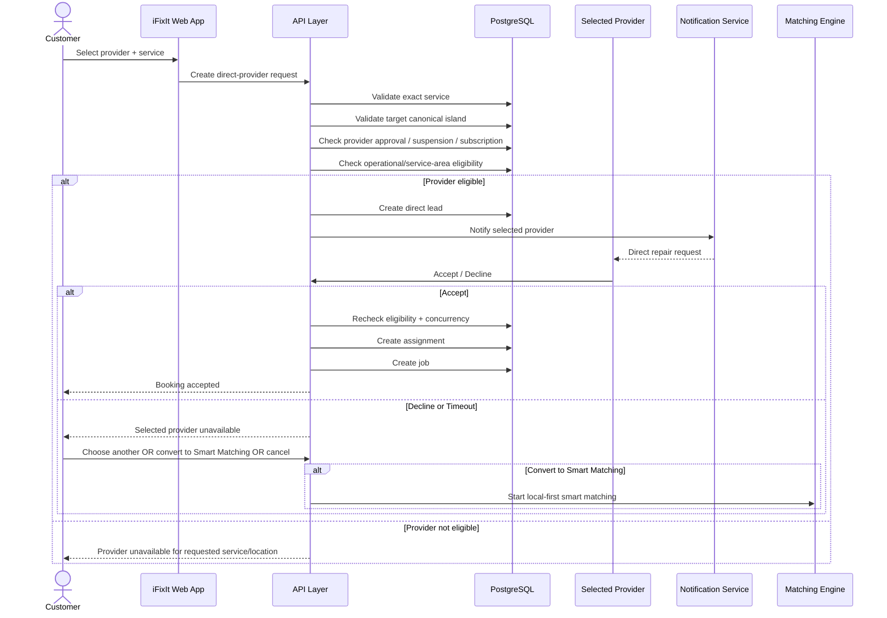
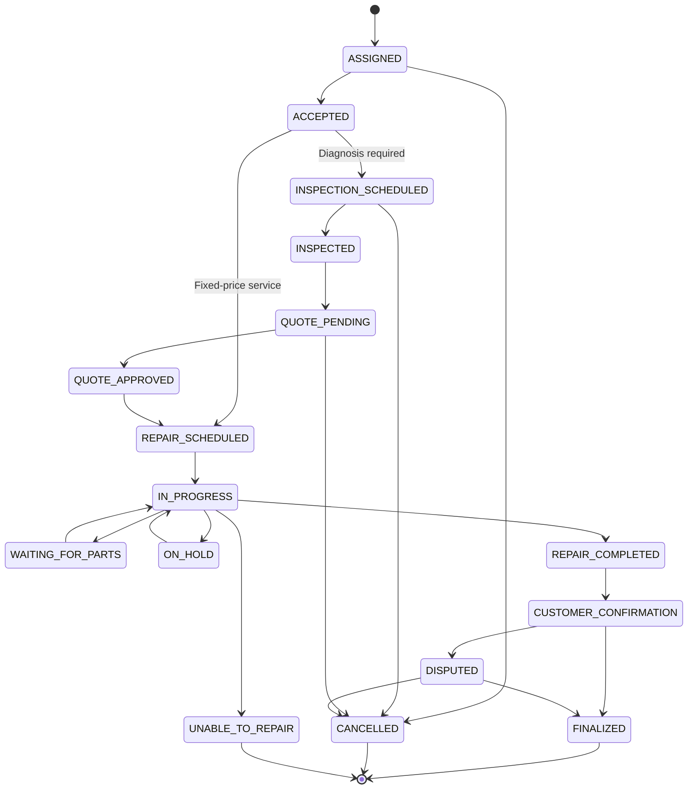

# iFixIt — Step 11: UML System Design

**Document Type:** UML / System Design Blueprint  
**Status:** Implementation Baseline  
**Version:** 1.0  
**Date:** 2026-08-19

---

## 1. Purpose

This document translates the approved iFixIt business, functional, location-matching, database and workflow specifications into a developer-readable UML design package.

It must be read together with:
- `MVP_BUSINESS_MODEL_AND_SCOPE_FREEZE.md`
- `LOCAL_ISLAND_MATCHING_AND_LOCATION_ARCHITECTURE.md`
- `STEP_3_DETAILED_USE_CASES_AND_BUSINESS_RULES.md`
- `STEP_5_FUNCTIONAL_SPECIFICATION_FREEZE.md`
- `STEP_6_DATABASE_SCHEMA_AND_DATA_DICTIONARY.md`
- `STEP_7_API_CONTRACTS.md`
- `STEP_8_ROLES_AND_PERMISSION_MATRIX.md`
- `STEP_9_FORMAL_STATE_TRANSITION_MATRICES.md`

Where a diagram simplifies a rule, the detailed source document remains authoritative.

---

# 2. UML Package Overview

The iFixIt UML baseline consists of eight core diagrams:

1. System Use Case Diagram
2. Domain Class Diagram
3. Customer Repair Activity Diagram
4. Island Matching Activity Diagram
5. Smart Matching Sequence Diagram
6. Direct Provider Booking Sequence Diagram
7. Repair Job State Diagram
8. Component / Architecture Diagram

These diagrams cover who uses the system, the principal domain objects, repair workflow, local-island dispatch behavior, runtime interactions and system structure.

---

# 3. UML-01 — System Use Case Diagram

### Interpretation

Customer use cases center on finding service, booking, repair tracking and post-completion actions. Provider use cases center on eligibility, service geography, request acceptance, inspection/quotation and repair execution. Admin use cases cover governance, verification, assignment, configuration, reporting and audit.

---

# 4. UML-02 — Domain Class Diagram

### Key domain rules

- `Island.id` is the authoritative geographic key; island names are not used for equality matching.
- `ProviderLocation` distinguishes registered address, operational base, branch and temporary base.
- `ProviderServiceArea` represents explicitly supported islands.
- `MatchingAttempt` records each geographic expansion/matching decision.
- A repair request may have multiple leads/assignment attempts but only one active exclusive assignment where exclusivity applies.
- Quotation revisions are versioned.

---

# 5. UML-03 — Customer Repair Activity Diagram

### Activity rule

The quotation path is mandatory for `DIAGNOSIS_REQUIRED` services before charge-changing repair work proceeds. `FIXED_PRICE` services may move directly to scheduled service unless additional work requires customer reauthorization.

---

# 6. UML-04 — Local Island Matching Activity Diagram

### Geographic tiers

- **Tier 0:** active operational base on exact target island.
- **Tier 1:** provider based elsewhere but explicitly approved to service the target island.
- **Tier 2:** same-atoll cross-island fallback where policy and provider travel eligibility permit.
- **Tier 3:** cross-atoll / special dispatch under explicit policy or administrative authorization.

The engine must never silently broaden geography.

---

# 7. UML-05 — Smart Matching Sequence Diagram

### Sequence controls

Provider eligibility must be rechecked at acceptance time. Exclusive assignment must be concurrency-safe so multiple providers cannot own the same exclusive job.

---

# 8. UML-06 — Direct Provider Booking Sequence Diagram

### Direct-booking rule

A direct booking must never be silently redistributed to another provider. Customer consent is required before conversion to Smart Matching.

---

# 9. UML-07 — Repair Job State Diagram

### State rule

State changes must be validated server-side and stored in immutable/history records. Admin state corrections require elevated permission, reason and audit entry.

---

# 10. UML-08 — Component / Architecture Diagram

```mermaid
flowchart TB

    subgraph Clients
        PUBLIC[Public Marketplace]
        CUSTOMER[Customer Portal]
        PROVIDER[Provider Portal]
        ADMIN[Admin Portal]
    end

    subgraph Backend["iFixIt Modular Monolith / API"]
        AUTH[Authentication]
        CUST[Customer Module]
        PROV[Provider Module]
        VERIFY[Verification Module]
        CAT[Repair Catalogue]
        LOC[Atoll / Island Location Module]
        MATCH[Local-First Matching Engine]
        REQUEST[Repair Request Module]
        ASSIGN[Lead / Assignment Module]
        JOB[Job Module]
        INSPECT[Inspection Module]
        QUOTE[Quotation Module]
        PARTS[Parts / Labour Module]
        WARRANTY[Warranty Module]
        REVIEW[Review Module]
        COMPLAINT[Complaint Module]
        SUB[Subscription Module]
        PAYMENTS[Subscription Payment Module]
        NOTIFY[Notification Module]
        REPORT[Reporting / Supply-Demand Analytics]
        AUDIT[Audit Module]
    end

    DB[(PostgreSQL)]
    STORAGE[(Private Object Storage)]
    QUEUE[(Background Job Queue)]

    OTP[OTP / SMS]
    EMAIL[Email]
    WA[WhatsApp]
    GATEWAY[Payment Gateway]
    MONITOR[Monitoring / Alerting]

    PUBLIC --> CAT
    PUBLIC --> LOC
    PUBLIC --> PROV

    CUSTOMER --> AUTH
    CUSTOMER --> CUST
    CUSTOMER --> REQUEST
    CUSTOMER --> QUOTE

    PROVIDER --> AUTH
    PROVIDER --> PROV
    PROVIDER --> ASSIGN
    PROVIDER --> JOB
    PROVIDER --> INSPECT
    PROVIDER --> QUOTE

    ADMIN --> AUTH
    ADMIN --> VERIFY
    ADMIN --> LOC
    ADMIN --> ASSIGN
    ADMIN --> COMPLAINT
    ADMIN --> SUB
    ADMIN --> REPORT
    ADMIN --> AUDIT

    REQUEST --> LOC
    REQUEST --> MATCH
    MATCH --> PROV
    MATCH --> LOC
    MATCH --> ASSIGN

    ASSIGN --> JOB
    JOB --> INSPECT
    INSPECT --> QUOTE
    JOB --> PARTS
    JOB --> WARRANTY
    JOB --> REVIEW
    JOB --> COMPLAINT

    AUTH --> DB
    CUST --> DB
    PROV --> DB
    VERIFY --> DB
    CAT --> DB
    LOC --> DB
    MATCH --> DB
    REQUEST --> DB
    ASSIGN --> DB
    JOB --> DB
    INSPECT --> DB
    QUOTE --> DB
    SUB --> DB
    REPORT --> DB
    AUDIT --> DB

    REQUEST --> STORAGE
    INSPECT --> STORAGE
    VERIFY --> STORAGE
    COMPLAINT --> STORAGE

    NOTIFY --> QUEUE
    QUEUE --> OTP
    QUEUE --> EMAIL
    QUEUE --> WA

    SUB --> PAYMENTS
    PAYMENTS --> GATEWAY

    Backend --> AUDIT
    Backend --> MONITOR
```

### Architecture interpretation

The deployment baseline remains a modular monolith with clear business-module boundaries. PostgreSQL is the system-of-record database, private object storage holds media/documents, background jobs handle asynchronous work, and external providers supply OTP, notifications and subscription payments.

---

# 11. Traceability to Approved Requirements

| UML Diagram | Primary Requirement Sources |
|---|---|
| System Use Case | Steps 1, 3, 8 |
| Domain Class | Step 6 + Local Island Matching architecture |
| Customer Repair Activity | MVP Scope Freeze + Steps 3, 5, 9 |
| Island Matching Activity | Local Island Matching architecture |
| Smart Matching Sequence | MVP Scope Freeze + Local Matching + Step 7 |
| Direct Booking Sequence | MVP Scope Freeze + Step 7 |
| Job State Diagram | Step 9 |
| Component Architecture | Steps 1, 2, 7 + Local Matching architecture |

---

# 12. Developer Rules Derived from UML

1. Frontend state must never be treated as authoritative for permissions, assignment, provider eligibility, quotation approval or job status.
2. Canonical IDs are required for atoll/island matching; free-text names are display/search aids only.
3. Same-island operational-base providers are evaluated before broader geographic fallbacks.
4. Direct Provider Booking and Smart Matching are distinct flows.
5. Direct bookings require customer consent before broadening into Smart Matching.
6. `FIXED_PRICE` and `DIAGNOSIS_REQUIRED` services have different workflow paths.
7. Quotations are versioned and approval applies to a specific/current version.
8. Exclusive provider assignment must be concurrency-safe.
9. Matching-stage expansion must be auditable.
10. Job state transitions must use the formal transition matrix and history records.
11. Customer repair settlement remains outside MVP; payment-gateway integration is for provider subscription payments unless scope is later changed.
12. Media and verification documents must use private/authorized storage rules.

---

# 13. UML Change-Control Rule

Any future functional change that affects actors, entity relationships, workflow routing, matching logic, state transitions or component boundaries must trigger review of this UML document.

Examples:
- adding customer in-platform repair payment
- adding provider business staff/team dispatch
- changing same-island fallback behavior
- adding multi-provider bidding
- changing quotation authorization rules
- introducing AI-assisted assignment

The UML should remain synchronized with the implementation baseline rather than becoming a historical drawing only.

---

# 14. Approval Checklist

- [x] System actors represented
- [x] Direct Provider Booking represented
- [x] Smart Matching represented
- [x] FIXED_PRICE workflow represented
- [x] DIAGNOSIS_REQUIRED workflow represented
- [x] Canonical island model represented
- [x] Same-island Tier 0 priority represented
- [x] Tier 1 / same-atoll / cross-atoll fallback represented
- [x] Matching audit object represented
- [x] Repair request, lead, assignment and job represented
- [x] Inspection and quotation flows represented
- [x] Job state lifecycle represented
- [x] Core component architecture represented
- [x] Provider subscription/payment boundary represented

**Decision:** This UML package is part of the iFixIt pre-coding implementation blueprint and must be reviewed whenever the authoritative functional or architecture documents change.
