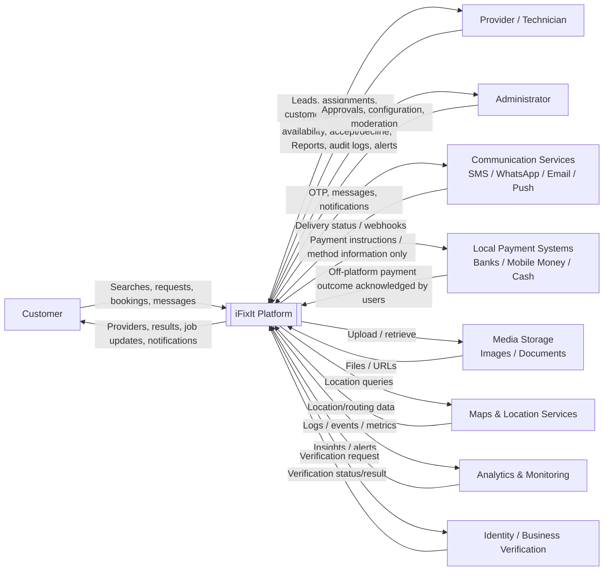

# iFixIt — Context Diagram Level 0

**View:** Business/system context  
**Purpose:** Show iFixIt as one system and the external actors/systems around it.

## Boundary Rules

- iFixIt connects customers and providers; it does not process or hold customer repair funds in MVP.
- Local payment systems are external to iFixIt.
- Provider subscription payments to iFixIt are a separate platform-payment concern.
- All location matching resolves to canonical Atoll/Island IDs before matching logic executes.
- Cross-atoll dispatch is never silent.

## Current Implementation Status

The central identity, location, catalogue, provider, search/matching, lead and assignment foundations are represented in migrations 0001–0005. Communication providers, media storage, maps, monitoring and external verification are target integrations unless separately implemented later.
