# iFixIt — Context Diagram Level 1

**View:** Major capabilities and external dependencies  
**Purpose:** Decompose the platform into its primary business capability groups.

```mermaid
flowchart TB
    subgraph ACTORS[External Actors]
        C[Customers]
        P[Providers / Technicians]
        A[Administrators]
    end

    subgraph IFX[iFixIt Platform]
        ID[1. Identity & Access\nPhone / OTP / RBAC]
        LOC[2. Location & Catalogue\nAtolls / Islands / Services]
        MATCH[3. Search & Matching\nTier 0–3 / Ranking / Eligibility]
        REQ[4. Requests & Booking\nDirect Booking / Smart Matching]
        JOB[5. Job Lifecycle\nAcceptance / Scheduling / Tracking]
        QUOTE[6. Inspections & Quotations\nVersioning / Approval]
        MSG[7. Communication\nNotifications / External Messaging]
        PAY[8. Off-Platform Payment Acknowledgement]
        TRUST[9. Trust & Safety\nRatings / Complaints / Disputes]
        SUB[10. Subscriptions & Promotions]
        ADMIN[11. Admin & Reporting]
        INT[12. Integrations]
        DB[(PostgreSQL Primary Data Store)]

        ID --> DB
        LOC --> DB
        MATCH --> DB
        REQ --> DB
        JOB --> DB
        QUOTE --> DB
        MSG --> DB
        PAY --> DB
        TRUST --> DB
        SUB --> DB
        ADMIN --> DB
    end

    C --> REQ
    C --> MATCH
    C --> JOB
    C --> TRUST
    C --> PAY

    P --> ID
    P --> LOC
    P --> MATCH
    P --> JOB
    P --> QUOTE
    P --> PAY
    P --> SUB

    A --> ADMIN
    A --> TRUST
    A --> SUB

    EXTMSG[Communication Channels] <--> MSG
    EXTPAY[Local Payment Systems\nOff-platform] <--> PAY
    MEDIA[Media Storage] <--> INT
    MAPS[Maps / Geo Services] <--> INT
    VERIFY[Verification Services] <--> INT
    OBS[Analytics / Monitoring] <--> INT
```

## Capability Interpretation

- **Implemented foundation through 0005:** Identity/RBAC schema, canonical location/catalogue, provider configuration, requests core, search/matching, leads, assignments and atomic acceptance.
- **Planned next:** Full job lifecycle, inspections/quotations, off-platform payment acknowledgement, trust/safety, subscription campaigns, admin reporting and production integrations.
- **In-app chat:** not assumed as an implemented MVP dependency. External/structured messaging and notifications remain sufficient unless full chat is separately approved.

## Critical Rules

1. Tier 0 same-island eligibility is highest geographic priority.
2. Tier 1 requires explicit provider service-area coverage.
3. Tier 2 same-atoll expansion requires request/policy permission.
4. Tier 3 cross-atoll expansion requires explicit authorization.
5. Direct Booking cannot silently convert to Smart Matching.
6. Customer repair settlement remains outside iFixIt processing.
