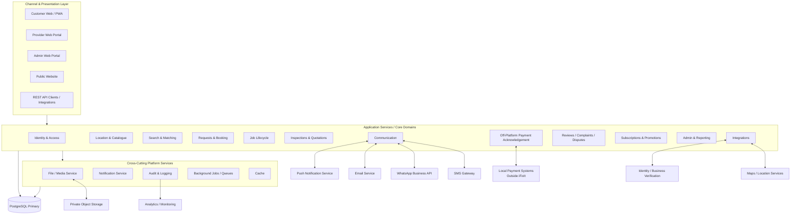

# iFixIt — Context Diagram Level 2

**View:** Application layers, data flows and trust boundaries  
**Purpose:** Show how channels, domain services, cross-cutting services and PostgreSQL fit together.

## Trust Boundaries

### Trusted iFixIt boundary

The channel, domain, cross-cutting and primary data-store layers are inside the iFixIt security boundary. Authentication, authorization, ownership checks, state validation and sensitive-event auditing must be enforced server-side.

### External/untrusted boundary

Messaging providers, payment systems, maps, object storage, monitoring and verification vendors are external integrations. Their payloads and callbacks must be authenticated/validated and must never be trusted merely because they arrived from an integration endpoint.

## Current-Code Alignment

Migrations 0001–0005 currently establish the database foundations for Identity & Access, Location & Catalogue, Provider Onboarding, Requests, Search & Matching, Leads and Assignments. The remaining domain boxes are target modules to be implemented in subsequent migrations/application services.

## Technology Status

- PostgreSQL is an approved primary authoritative datastore.
- RESTful API is an approved architectural pattern.
- Redis/cache, object-storage vendor, queue technology, runtime language/framework and deployment platform remain implementation choices unless separately frozen.
- Full in-app chat must not be treated as already implemented; communication can initially rely on structured notifications plus approved external contact channels.
