# iFixIt — Context Diagram Level 3

**View:** Detailed system-of-systems / target implementation architecture  
**Purpose:** Provide a developer-facing decomposition while keeping current implementation status explicit.

```mermaid
flowchart TB
    subgraph USERS[External Actors]
        C[Customer]
        P[Provider / Technician]
        A[Administrator]
    end

    subgraph PLATFORM[iFixIt Platform]
        subgraph PRESENTATION[Presentation Layer]
            CPWA[Customer Responsive Web / PWA]
            PP[Provider Portal]
            AP[Admin Portal]
            PUBLIC[Public Marketplace]
            GATEWAY[REST API Boundary]
        end

        subgraph APP[Application / Domain Layer]
            AUTH[Identity & Access\nOTP / Sessions / RBAC]
            GEO[Location & Catalogue\nAtolls / Islands / Exact Services]
            SEARCH[Provider Search & Matching\nTier 0–3 / Ranking]
            REQUESTS[Requests & Booking\nDirect / Smart]
            JOBS[Job Lifecycle\nAtomic Acceptance / Scheduling / Tracking]
            IQ[Inspection & Quotation\nVersioned Quote / Approval]
            COMMS[Communication & Notifications]
            PMT[Off-Platform Payment Acknowledgement]
            SAFETY[Reviews / Complaints / Disputes]
            BILL[Provider Subscriptions / Promotions]
            REPORT[Admin / Reporting]
            ADAPTERS[External Integration Adapters]
        end

        subgraph PLATFORM_SERVICES[Cross-Cutting Services]
            MEDIA[Media Service]
            AUDIT[Audit / Security Events]
            QUEUE[Background Jobs / Queue]
            CACHE[Cache / Acceleration]
            SCHED[Scheduler / Workers]
        end

        DB[(PostgreSQL Primary)]

        PRESENTATION --> APP
        APP --> PLATFORM_SERVICES
        APP --> DB
        PLATFORM_SERVICES --> DB
    end

    C --> CPWA
    P --> PP
    A --> AP

    MESSAGING[SMS / WhatsApp / Email / Push] <--> ADAPTERS
    STORAGE[Private Object Storage] <--> MEDIA
    MAPS[Maps / Routing / Geo Services] <--> ADAPTERS
    VERIFY[Identity / Business Verification] <--> ADAPTERS
    MONITOR[Monitoring / Analytics] <--> AUDIT
    LOCALPAY[Local Payment Systems\nCustomer ↔ Provider Directly] <--> PMT
```

## System-of-Systems Rules

- Customer and provider repair settlement occurs externally; iFixIt may only record acknowledgements/evidence in MVP.
- Provider subscription billing is a separate iFixIt financial domain.
- Direct Booking and Smart Matching share eligibility checks but have different fallback behavior.
- Matching progression is Tier 0 → Tier 1 → Tier 2 → Tier 3 and every expansion is auditable.
- Atomic acceptance and unique active-assignment constraints protect exclusive job ownership.
- `FIXED_PRICE` services do not require unnecessary inspection/quote steps; `DIAGNOSIS_REQUIRED` uses Inspection → Versioned Quotation → Customer Approval before charge-changing repair work.
- Server authorization, ownership checks and state transition validation apply regardless of client channel.

## Current vs Target

### Represented in committed migrations 0001–0005

- Core users/provider/request entities
- OTP/RBAC/security-event foundation
- canonical Atoll/Island and service catalogue
- provider exact services, pricing, service islands and availability
- provider verification metadata
- search/matching metrics
- matching attempts/candidates
- leads and assignments
- Direct Booking fallback-decision foundation
- concurrency-safe provider acceptance

### Target modules still to implement

- full repair job timeline/state model
- inspections and versioned quotations
- completion/warranty expansion
- off-platform payment acknowledgement/dispute tables
- reviews/complaints/notification engine
- subscriptions/promotional campaigns and entitlement binding
- admin/reporting implementation
- external adapters, media service and production observability

## Technology Interpretation

The logical architecture does not require a specific vendor/runtime beyond the currently approved PostgreSQL + REST direction. Node.js/TypeScript, Redis, S3-compatible object storage, containers/Kubernetes and specific third-party vendors should be treated as target/proposed choices until formally selected and committed.
